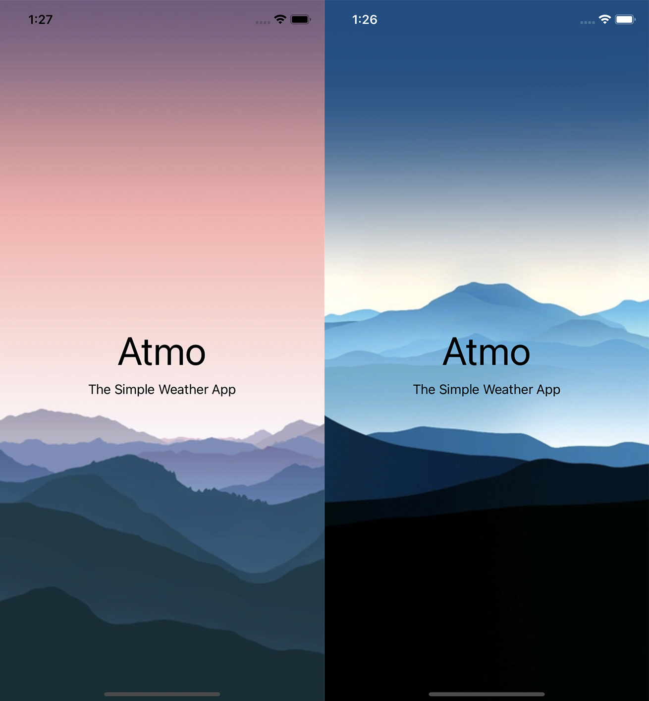
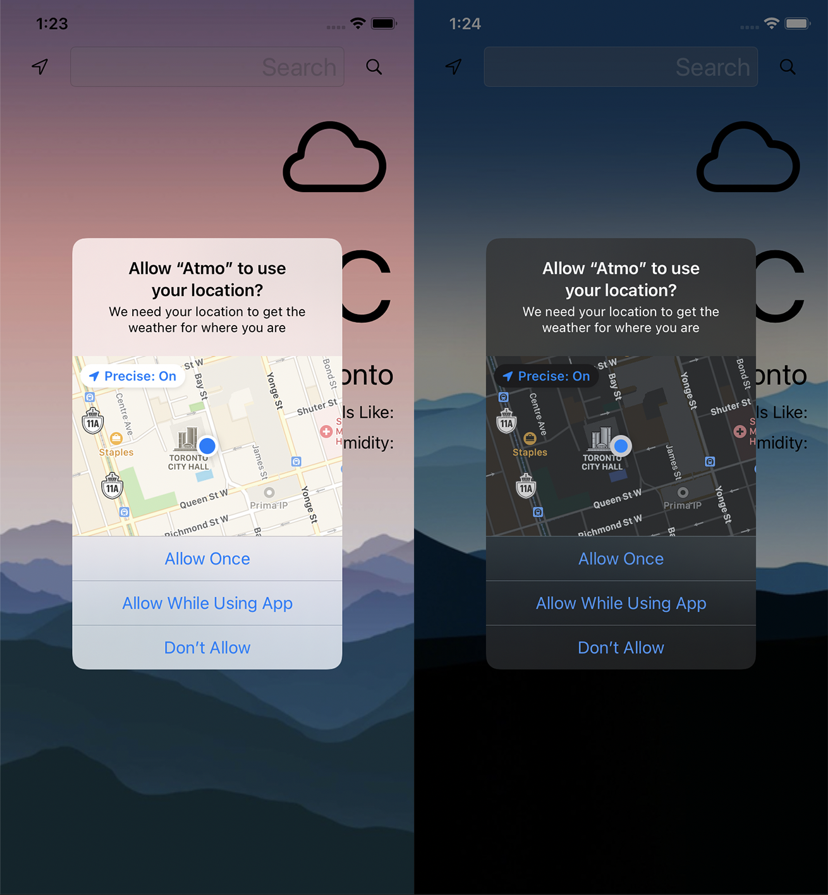
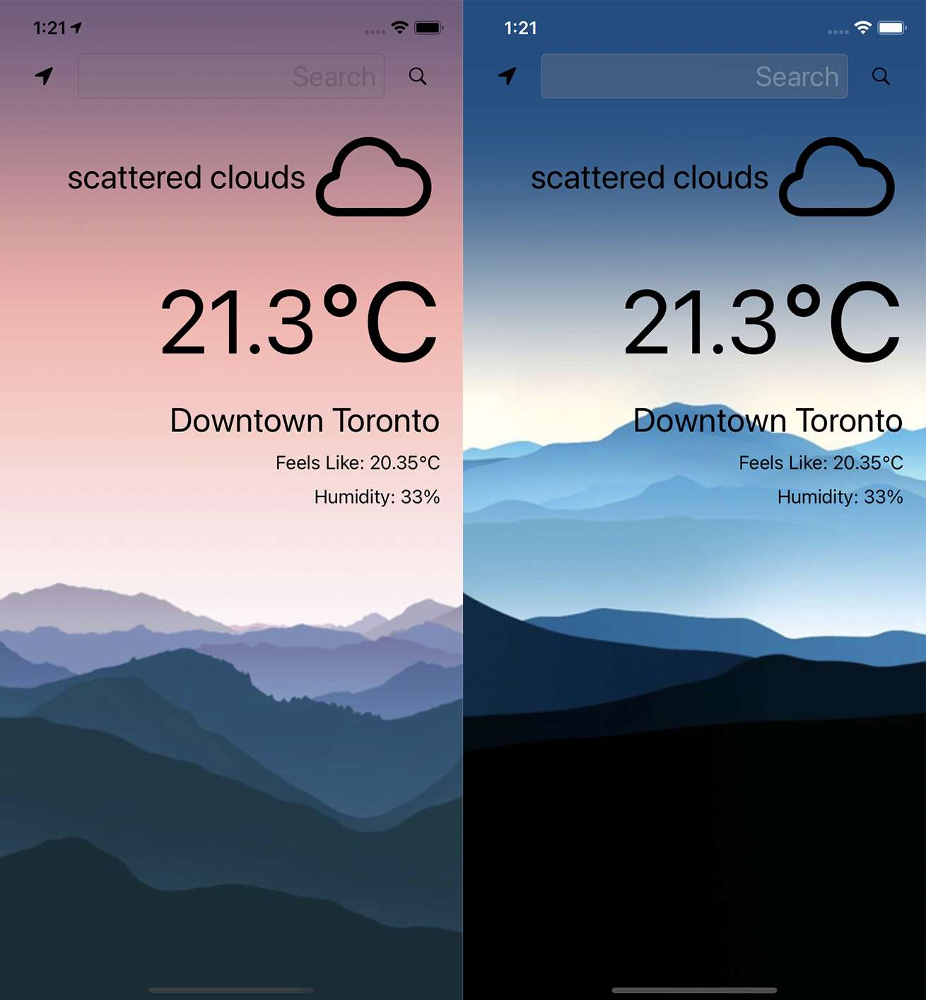

# Atmo - The Simple Weather App

## What is Atmo?
Atmo is a simple weather app using [OpenWeatherMap's](https://openweathermap.org/api) API and iOS's [CoreLocation](https://developer.apple.com/documentation/corelocation/) service to provide users with weather conditions

# Architecture
- MVC structure
- Light & Dark Mode Support

  
  
  

# How to Use Atmo
1. Sign up (for free) for an API key from [OpenWeatherMap](https://home.openweathermap.org/users/sign_up)
2. Copy your API key to the `Atmo/Models/AtmoWeatherManager.swift` file, replacing `YOUR_API_KEY_HERE` in the `weatherUrl` variable - **Atmo will not run properly without this change**
3. Install & enjoy!
